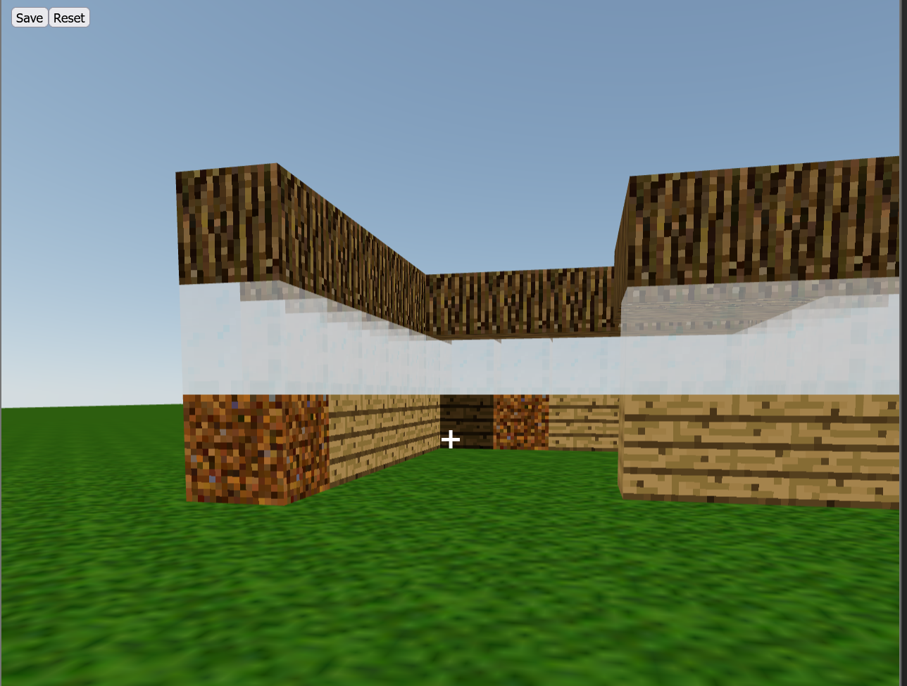

# Minecraft in the browser using React and Vite

This is a small project to learn how to make games with react and use vite to have faster reloads. 

# Run locally 
If you want to run this program on your computer, clone this repository and run the command npm install.
Then run the command npm run dev and you can play a basic version of minecraft, happy building!

# Learning points
The main things I learned here are the following.
-[x] how to use threejs 
- [x] how to use zuustand for state management
- [x] how to handle collision and how to stack objects
- [x] how to overlay 2d standard react ui over 3d canva
- [x] how to work with textures in react